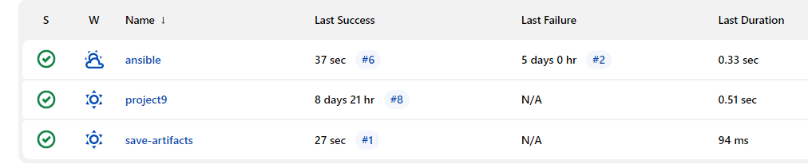
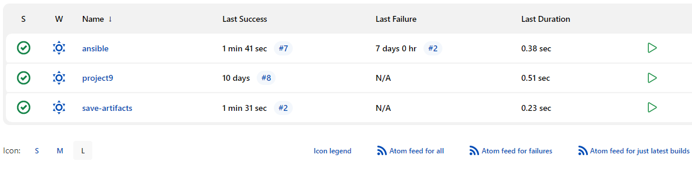

# Project12-Ansible-Refactoring
## Jenkins job enhancement
> Go to your Jenkins-Ansible server and create a new directory called ansible-config-artifact
```
sudo mkdir /home/ubuntu/ansible-config-artifact
chmod -R 0777 /home/ubuntu/ansible-config-artifact
```
> Go to Jenkins web console -> Manage Jenkins -> Manage Plugins -> on Available tab search for Copy Artifact and install this plugin without restarting Jenkin
> Create a new Freestyle project and name it save_artifacts then configure the project to be triggered by completion of your existing ansible project.
> The main idea of save_artifacts project is to save artifacts into /home/ubuntu/ansible-config-artifact directory. To achieve this, create a Build step and choose Copy artifacts from other project, specify ansible as a source project and /home/ubuntu/ansible-config-artifact as a target directory.
> Test your set up by making some change in README.MD file inside your ansible project directory.
> You should get 2 successive builds from your ansible project and ansible-artifact project respectively.




## Refactor Ansible code by importing other playbooks into site.yml
> pulled down the latest code from master (main) branch, and created a new branch, name it refactor.
> Within playbooks folder, create a new file and name it site.yml
> Create a new folder in root of the repository and name it static-assignments.
> Move common.yml file into the newly created static-assignments folder.
Inside site.yml file, import common.yml playbook.
```
---
- hosts: all
- import_playbook: ../static-assignments/common.yml
```
> create another playbook under static-assignments and name it common-del.yml. In this playbook, configure deletion of wireshark utility.
```
---
- name: update web, nfs and db servers
  hosts: webservers, nfs, db
  remote_user: ec2-user
  become: yes
  become_user: root
  tasks:
  - name: delete wireshark
    yum:
      name: wireshark
      state: removed

- name: update LB server
  hosts: lb
  remote_user: ubuntu
  become: yes
  become_user: root
  tasks:
  - name: delete wireshark
    apt:
      name: wireshark-qt
      state: absent
      autoremove: yes
      purge: yes
      autoclean: yes
```
> update site.yml with - import_playbook: ../static-assignments/common-del.yml instead of common.yml and run it against dev servers:
> Run ansible-playbook command against the dev environment
```
ansible-playbook -i inventory/dev.yml playbooks/site.yam
wireshark --version
```
> you should have the following results:


## Configure UAT Webservers with a role ‘Webserver’
> Launch 2 EC2 instances using RHEL 8 image and name them as  Web1-UAT and Web2-UAT
> Create a role by creating a directory called roles/ relative to the playbook file or in /etc/ansible/ directory.
> Use an Ansible utility called ansible-galaxy to create the role's folder structure.
```
mkdir roles
cd roles
ansible-galaxy init webserver
```
> Update your uat.yml inventory file with IP addresses of your 2 UAT Web servers
```
[uat-webservers]
<Web1-UAT-Server-Private-IP-Address> ansible_ssh_user='ec2-user' 

<Web2-UAT-Server-Private-IP-Address> ansible_ssh_user='ec2-user' 
```
> In `/etc/ansible/ansible.cfg` file uncomment roles_path string and provide a full path to your roles directory `roles_path    = /home/ubuntu/ansible-config-mgt/roles`, so Ansible could know where to find configured roles.

> Go into tasks directory, and within the main.yml file, start writing configuration tasks to do the following:
1. Install and configure Apache (httpd service)
2. Clone Tooling website from GitHub https://github.com/<your-name>/tooling.git.
3. Ensure the tooling website code is deployed to /var/www/html on each of 2 UAT Web servers.
4. Make sure httpd service is started
> Your main.yml may consist of following tasks:
```
---
- name: install apache
  become: true
  ansible.builtin.yum:
    name: "httpd"
    state: present

- name: install git
  become: true
  ansible.builtin.yum:
    name: "git"
    state: present

- name: clone a repo
  become: true
  ansible.builtin.git:
    repo: https://github.com/<your-name>/tooling.git
    dest: /var/www/html
    force: yes

- name: copy html content to one level up
  become: true
  command: cp -r /var/www/html/html/ /var/www/

- name: Start service httpd, if not started
  become: true
  ansible.builtin.service:
    name: httpd
    state: started

- name: recursively remove /var/www/html/html/ directory
  become: true
  ansible.builtin.file:
    path: /var/www/html/html
    state: absent
```
##  Reference ‘Webserver’ role
> Within the static-assignments folder, create a new assignment for uat-webservers uat-webservers.yml. This is where you will reference the role.
```
---
- hosts: uat-webservers
  roles:
     - webserver
```
> Remember that the entry point to our ansible configuration is the site.yml file. Therefore, you need to refer your uat-webservers.yml role inside site.yml.
```
---
- hosts: all
- import_playbook: ../static-assignments/common.yml

- hosts: uat-webservers
- import_playbook: ../static-assignments/uat-webservers.yml
```
## Commit & Test
> Commit your changes, create a Pull Request and merge them to master branch. Webhook will trigger two consequent Jenkins jobs, they ran successfully and copied all the files to your Jenkins-Ansible server into /home/ubuntu/ansible-config-mgt/ directory.


> Now run the playbook against your uat inventory.
```
sudo ansible-playbook -i /home/ubuntu/ansible-config-mgt/inventory/uat.yml /home/ubuntu/ansible-config-mgt/playbooks/site.yaml
```
> You should be able to see both of your UAT Web servers configured and you can try to reach them from your browser:

`http://<Web1-UAT-Server-Public-IP-or-Public-DNS-Name>/index.php`

